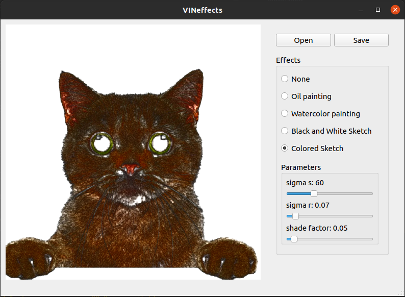

# VINeffects

**Autor**: Natália Holková

## O aplikácii

Projekt do predmetu Výtvarná informatika (2021/22). Jedná sa o jednoduchú Linux desktop aplikáciu na výtvarnú štylizáciu obrázkov.
Poskytuje 4 rôzne výtvarné efekty, ktoré implentuje pomocou knižnice *OpenCV*:
- olejomaľba
- vodové farby
- čierno-biela skica
- farebná skica

Podporuje obrázky .jpg a .png.

### Olejomaľba


### Vodové farby


### Čierno-biela skica


### Farebná skica


## Inštalácia

Inštalácia a spustenie bolo testované na operačnom systéme Ubuntu 20.04.
Prerekvizity:
- Python3, pip

Inštalácia prebieha pomocou skriptu `install.sh`, ktorý Python *venv* a nainštaluje potrebné balíčky. Skript najskôr nastavte na spustiteľný príkazom:
```
chmod +x install.sh
```

Následne spustite skript príkazom:
```
./install.sh
```

## Spustenie
Skript najskôr nastavte na spustiteľný príkazom:
```
chmod +x run.sh
```

Aplikáciu je možné spustiť skriptom `run.sh`:
```
./run.sh
```